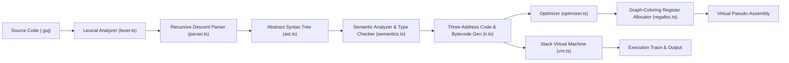

# GujLang Compiler & Visualizer Studio: Codebase Audit and Remediation

> **Current review status (2026-09-30):** The baseline audit below contains 24 numbered
> findings, not 31 as its original summary claimed. The listed issues were reproduced or
> reviewed against the code and have been addressed in the working tree; see the disposition
> table at the end. BUG-02 was resolved with definite-assignment analysis, preserving the
> binding flat-scope rule in `GRAMMAR.md` rather than changing the language semantics.
> This is an implementation review record, not a claim that every production property (for
> example offline deployment behavior) has been independently certified.

**Target System:** GujLang Compiler v2 & Browser-based Visualizer Studio  
**Audit Scope:** Full codebase analysis (`src/`, `visualizer/`, `test/`, `samples/`, configuration, and specification documents)  
**Standard Evaluated:** Production-Grade Compiler & Web Application System

---

## 1. System Architecture & Operation Overview

### 1.1 Purpose of the System
GujLang is an educational and domain-specific imperative programming language featuring phonetically Gujarati-inspired keywords alongside English aliases. It implements an end-to-end 6-phase compiler pipeline with dual execution/codegen backends and an interactive React-based visualizer:



### 1.2 Pipeline Components
1. **Lexical Analysis ([src/lexer.ts](file:///c:/Harsh/Privet%20Folder/Project/PCD/src/lexer.ts)):** Table-driven scanner converting character streams into typed `Token` objects with exact line, column, and offset spans. Supports single-line comments (`#`, `//`), string literals with escape sequences, numeric literals (int/float), and multi-word keywords (`pachu aap`, `nahi to`).
2. **Syntax Analysis ([src/parser.ts](file:///c:/Harsh/Privet%20Folder/Project/PCD/src/parser.ts)):** Recursive-descent parser producing an AST ([src/ast.ts](file:///c:/Harsh/Privet%20Folder/Project/PCD/src/ast.ts)). Implements panic-mode error recovery synchronizing on statement starts, block terminators (`bas`/`end`), or EOF.
3. **Semantic Analysis ([src/semantics.ts](file:///c:/Harsh/Privet%20Folder/Project/PCD/src/semantics.ts)):** Static type inference and validation (`int`, `float`, `bool`), symbol table management with flat global and function-local scopes, duplicate declaration rejection, arity and type checking on calls, and path return validation (`alwaysReturns`).
4. **Intermediate Representation ([src/ir.ts](file:///c:/Harsh/Privet%20Folder/Project/PCD/src/ir.ts)):** Dual IR generator: linear stack-based bytecode instructions for VM execution and quad-like Three-Address Code (TAC) with temporary registers and control-flow labels.
5. **Optimization ([src/optimizer.ts](file:///c:/Harsh/Privet%20Folder/Project/PCD/src/optimizer.ts)):** Independently toggleable basic-block constant folding and backward liveness-based Dead Code Elimination (DCE).
6. **Register Allocation ([src/regalloc.ts](file:///c:/Harsh/Privet%20Folder/Project/PCD/src/regalloc.ts)):** Virtual register allocation over TAC interference graphs using degree-ordered greedy graph coloring, outputting pseudo-assembly with spill annotations.
7. **Virtual Machine ([src/vm.ts](file:///c:/Harsh/Privet%20Folder/Project/PCD/src/vm.ts)):** Stack-based bytecode interpreter featuring call-frame management (max depth 1024), runtime instruction capping (100,000 steps) for infinite loop protection, and step-by-step state snapshotting.
8. **Interactive Studio ([visualizer/App.tsx](file:///c:/Harsh/Privet%20Folder/Project/PCD/visualizer/App.tsx) & [visualizer/GujLangEditor.tsx](file:///c:/Harsh/Privet%20Folder/Project/PCD/visualizer/GujLangEditor.tsx)):** React 19 web application providing synchronized views into tokens, AST, symbol table evolution, TAC optimization diffs, register mappings, and VM execution stepping.

---

## 2. Executive Summary of Audit Findings

| Category | Critical | Major | Moderate | Low | Total |
|---|:---:|:---:|:---:|:---:|:---:|
| **Compiler Core & Codegen** | 2 | 3 | 2 | 2 | **9** |
| **Lexing & Parsing** | 1 | 2 | 3 | 1 | **7** |
| **Optimization & Analysis** | 0 | 2 | 1 | 0 | **3** |
| **Runtime & Execution** | 0 | 1 | 1 | 1 | **3** |
| **Visualizer & Frontend** | 0 | 1 | 3 | 2 | **6** |
| **Tooling, Build & Test** | 1 | 1 | 0 | 1 | **3** |
| **Original summary (incorrect)** | **4** | **10** | **10** | **7** | **31** |

The original report grouped only 24 findings under BUG-01 through BUG-24; its category
totals cannot be reconciled to those entries and are retained here only as baseline metadata.

---

## 3. Critical Severity Defects

### BUG-01: Function Parameters Omitted from Register Definitions Causes Systematic Register Clobbering
- **Location:** [src/regalloc.ts#L118-L132](file:///c:/Harsh/Privet%20Folder/Project/PCD/src/regalloc.ts#L118-L132)
- **Classification:** Logic Defect / Codegen Clobbering
- **Description:**  
  In [regalloc.ts](file:///c:/Harsh/Privet%20Folder/Project/PCD/src/regalloc.ts), the helper `def(instruction)` determines what variable is defined by an instruction:
  ```typescript
  function def(instruction: TacInstruction): string | undefined {
    return ["const", "copy", "unary", "binary", "call"].includes(instruction.op)
      ? (instruction as { target: string }).target
      : undefined;
  }
  ```
  The `{ op: "function", name: string, parameters: string[] }` instruction is completely ignored by both `def()` and `uses()`. Consequently, function parameters are **never treated as definitions** in any instruction. Because `def(instruction)` is undefined for parameters, the interference-building loop:
  ```typescript
  if (definition) {
    if (!graph.has(definition)) graph.set(definition, new Set());
    for (const live of liveOut[i]) edge(definition, live);
  }
  ```
  **never executes for any function parameter**. As a result, no interference edge is ever constructed between multiple parameters of a function, even when all parameters are simultaneously live across the entire body.
- **Proof of Failure:**  
  Compiling `kaam add(a: int, b: int) -> int kar pachu aap a + b bas` produces:
  ```json
  Registers: { "t1": "R0", "t2": "R1", "add::a": "R0", "add::b": "R0", "t3": "R0" }
  Interference: [ [ "t1", "t2" ] ]
  ```
  Both `add::a` and `add::b` are assigned to register **`R0`**. In pseudo-assembly, this emits:
  `CALL add(R0, R0) -> R0`, completely clobbering arguments.
- **Remediation:**  
  Update `def()` or the interference pass to treat all parameters of `{ op: "function" }` as definitions, and add mutual interference edges between every parameter pair in the signature.

---

### BUG-02: Block Declaration Leakage Bypasses Static Safety and Causes Unhandled VM Crashes
- **Location:** [src/semantics.ts#L122-L191](file:///c:/Harsh/Privet%20Folder/Project/PCD/src/semantics.ts#L122-L191)
- **Classification:** Type System Flaw / Runtime Crash
- **Description:**  
  The semantic analyzer uses a single `Map<string, ValueType>` (`env`) that is passed directly into nested blocks:
  ```typescript
  checkStatements(
    stmt.kind === "if" ? stmt.thenBlock : stmt.body,
    env,
    scope,
    returnType,
    loopDepth + (stmt.kind === "while" ? 1 : 0),
  );
  ```
  When a declaration (`rakh x = ...`) occurs inside a conditional `jo ... to kar ... bas` or `jyare ... kar ... bas`, `env.set(stmt.name, valueType)` permanently records `x` in the enclosing scope without block scope destruction or definite assignment tracking.
- **Proof of Failure:**  
  The following program compiles with **zero static diagnostics**:
  ```
  jo khotu to kar
    rakh temp = 99
  bas
  bolo temp
  ```
  Because the condition is false, `temp` is never stored into `variables` by the VM. At runtime, the VM executes `LOAD temp` and crashes:
  ```json
  { "phase": "runtime", "code": "R001", "message": "Undefined variable 'temp'" }
  ```
  This violates the guarantee in `PROJECT_DESCRIPTION.md` §8: *"Never generate code from an invalid program."*
- **Remediation:**  
  Implement lexical block scoping using parent-linked environment scopes, or run a definite assignment pass that rejects using a variable whose declaration or assignment is not guaranteed on all preceding control paths.

---

### BUG-03: Precedence Inversion Between `NOT` and Arithmetic / Unary Operators
- **Location:** [src/parser.ts#L212-L224](file:///c:/Harsh/Privet%20Folder/Project/PCD/src/parser.ts#L212-L224) vs [src/parser.ts#L251-L258](file:///c:/Harsh/Privet%20Folder/Project/PCD/src/parser.ts#L251-L258)
- **Classification:** Grammar & Parser Discrepancy
- **Description:**  
  [GRAMMAR.md §4](file:///c:/Harsh/Privet%20Folder/Project/PCD/GRAMMAR.md) specifies the explicit operator precedence order from low to high:
  1. `athva` / `or`
  2. `ane` / `and`
  3. `nathi` / `not`
  4. Comparisons (`>`, `<`, `==`, etc.)
  5. `+` and `-`
  6. `*` and `/`
  7. Unary `-`
  
  In [parser.ts](file:///c:/Harsh/Privet%20Folder/Project/PCD/src/parser.ts), `notExpr()` implements level 3. However, `unary()` (level 7) also matches `NOT`:
  ```typescript
  function unary(): Expr {
    if (match("-", "NOT", "NOT_SYMBOL")) {
      const op = previous(), operand = unary();
      return { kind: "unary", op: op.type === "-" ? "-" : "not", operand, span: join(op.span, operand.span) };
    }
    return primary();
  }
  ```
- **Impact:**  
  Because `unary()` is called inside `mul()` and `add()`, expressions like `a * not b` or `a + not b` are erroneously parsed and accepted, giving `not` higher precedence than multiplication and addition. Furthermore, `- not x` is accepted, inverting the relative precedence between unary negation and boolean `not`.
- **Remediation:**  
  Remove `"NOT"` and `"NOT_SYMBOL"` from `unary()`. `unary()` must only match unary `-` and delegate to `primary()`, strictly following the grammar: `unary_expr := '-' unary_expr | primary`.

---

### BUG-04: CLI Script Configured with Persistent `--watch` Flag Causes Non-Interactive Hangs
- **Location:** [package.json#L11](file:///c:/Harsh/Privet%20Folder/Project/PCD/package.json#L11)
- **Classification:** Tooling / Pipeline Blocker
- **Description:**  
  Line 11 of `package.json` configures:
  ```json
  "cli": "bun --watch src/cli.ts"
  ```
  README.md instructs users: `bun run cli samples/branching.guj`. Because of `--watch`, running this command in CI/CD, non-interactive shells, scripts, or evaluation tools causes the process to hang indefinitely waiting for filesystem events instead of terminating after output generation.
- **Remediation:**  
  Remove `--watch` from the `"cli"` script: `"cli": "bun src/cli.ts"`. Reserve watch mode for a dedicated script such as `"cli:watch": "bun --watch src/cli.ts"`.

---

## 4. Major Severity Defects

### BUG-05: Lack of Boolean Short-Circuit Evaluation Induces Unintended Runtime Faults
- **Location:** [src/ir.ts#L62-L66](file:///c:/Harsh/Privet%20Folder/Project/PCD/src/ir.ts#L62-L66) & [src/ir.ts#L170-L173](file:///c:/Harsh/Privet%20Folder/Project/PCD/src/ir.ts#L170-L173)
- **Classification:** Semantic / Codegen Soundness
- **Description:**  
  In both TAC and bytecode generation, binary boolean expressions (`AND`, `OR`, `ane`, `athva`) eagerly evaluate both left and right expressions:
  ```typescript
  expr(e.left);
  expr(e.right);
  code.push({ op: "BINARY", operator: e.op });
  ```
- **Impact:**  
  1. Standard guarding conditions crash the application. For example:
     ```
     rakh x = 0
     jo x != 0 ane 10 / x > 2 to kar
       bolo 1
     bas
     ```
     Because the right operand is eagerly evaluated, `10 / 0` executes and halts the VM with `Division by zero`.
  2. Functions with side-effects in boolean expressions always execute regardless of whether the condition already resolved to false or true.
- **Remediation:**  
  Implement short-circuit control-flow branching in `generate()` and `generateTac()` for `AND` and `OR` using conditional jumps (`JUMP_IF_FALSE` / `ifFalse` and short-circuit bypasses).

---

### BUG-06: Demo 4 ("Multiple errors") Silently Fails to Run or Display Semantic Diagnostics
- **Location:** [src/compiler.ts#L38-L43](file:///c:/Harsh/Privet%20Folder/Project/PCD/src/compiler.ts#L38-L43) & [visualizer/App.tsx#L31-L34](file:///c:/Harsh/Privet%20Folder/Project/PCD/visualizer/App.tsx#L31-L34)
- **Classification:** Pipeline Orchestration & Teaching Feature Defect
- **Description:**  
  In `compiler.ts`:
  ```typescript
  const lexed = lex(source), parsed = parse(lexed.tokens), diagnostics = [...lexed.diagnostics, ...parsed.diagnostics];
  if (diagnostics.length) return { tokens: lexed.tokens, diagnostics, symbols: [] };
  const checked = analyze(parsed.module);
  ```
  If any syntax error is recorded by the parser, `compile()` **returns immediately on line 39 without calling `analyze(parsed.module)`**.
  
  In `visualizer/App.tsx`, Demo 4 is titled **"Multiple errors"** with the explicit description: *"Inspect parser recovery and semantic diagnostics."*
  ```
  rakh = 4
  bolo unknown
  rakh ready = sacu
  ready = 2
  ```
  The parser encounters a syntax error on line 1 (`rakh = 4`), recovers at line 2 (`bolo unknown`), and successfully parses the remaining lines. Because `diagnostics.length > 0`, `analyze()` never runs.
- **Proof of Failure:**  
  Executing `compile()` on Demo 4 returns **only 1 error**:
  `[ [ "parser", "P001", "Expected a variable name" ] ]`.  
  Neither `bolo unknown` (undeclared variable `S001`) nor `ready = 2` (type mismatch `S009`) is ever reported. The demo fails to deliver its stated purpose.
- **Remediation:**  
  Allow semantic analysis to run on successfully parsed module subtrees even if recoverable parser errors occurred, or provide distinct demonstration modes for pure parser recovery vs semantic errors.

---

### BUG-07: Dead Code Elimination Fails to Eliminate Dead / Unreachable Blocks
- **Location:** [src/optimizer.ts#L58-L115](file:///c:/Harsh/Privet%20Folder/Project/PCD/src/optimizer.ts#L58-L115)
- **Classification:** Optimization Pass Incompleteness
- **Description:**  
  DCE in `optimizer.ts` is implemented strictly as a backward liveness pass on variables. It lacks a forward control-flow reachability analysis (unreachable block elimination).
  Furthermore, line 106 restricts elimination:
  ```typescript
  if (definition && !liveOut[index].has(definition) && ["const", "copy", "unary", "binary"].includes(instruction.op))
  ```
  Instructions with side-effect ops (`print`, `call`, `return`) or instructions without defined variables are never pruned, even if they reside in code that has no path from function entry (e.g. statements placed after a `return` or unconditional `goto`).
- **Remediation:**  
  Add a CFG reachability pass before backward liveness analysis to eliminate unreachable basic blocks following returns and unconditional jumps.

---

### BUG-08: Complete Absence of Function Call Statements
- **Location:** [src/parser.ts#L44-L46](file:///c:/Harsh/Privet%20Folder/Project/PCD/src/parser.ts#L44-L46), [src/parser.ts#L100-L105](file:///c:/Harsh/Privet%20Folder/Project/PCD/src/parser.ts#L100-L105)
- **Classification:** Language Design & Usability Deficiency
- **Description:**  
  In `parser.ts`, `statementStart()` and `statement()` only recognize an identifier statement start if it is immediately followed by `=`:
  ```typescript
  (at("IDENT") && tokens[current + 1]?.type === "=")
  ```
  If a developer attempts to call a function as a standalone statement:
  ```
  greet("World")
  ```
  The parser matches `greet` as `IDENT`, requires `=`, finds `(`, and throws `Expected '='`.
- **Impact:**  
  Functions cannot be called purely for side-effects. Users are forced to invent dummy assignment variables:
  `rakh _dummy = greet("World")`.
- **Remediation:**  
  Add a `call_stmt` rule to `stmt` in the grammar and parser allowing an identifier followed by an argument list as a statement.

---

### BUG-09: Uncaught Missing File Exception (`ENOENT`) in CLI
- **Location:** [src/cli.ts#L10](file:///c:/Harsh/Privet%20Folder/Project/PCD/src/cli.ts#L10)
- **Classification:** Production Reliability
- **Description:**  
  `cli.ts` executes `readFileSync(resolve(inputPath), "utf8")` without a `try/catch` block. If the file does not exist, lacks read permissions, or is a directory, the CLI crashes with an unhandled Node.js filesystem stack trace.
- **Remediation:**  
  Wrap filesystem operations in a `try/catch` block and output a clean diagnostic matching compiler reporting conventions: `Error: Unable to read source file '${inputPath}'`.

---

### BUG-10: False-Positive Substring Matching in Annotation Tooltips
- **Location:** [visualizer/App.tsx#L1182](file:///c:/Harsh/Privet%20Folder/Project/PCD/visualizer/App.tsx#L1182)
- **Classification:** Frontend Visual Bug
- **Description:**  
  In `App.tsx`, `CodeList` matches optimization notes against TAC lines using simple substring search:
  ```typescript
  const note = annotations.find((annotation) => line.includes(annotation.split(":")[0]));
  ```
  Optimization annotations start with target temporary names (e.g. `t1: constant-folded ...` or `x: removed unused definition`).
- **Impact:**  
  - If `t1` was optimized, lines with `t10`, `t11`, `t12` match because `"t10 = ...".includes("t1")` is true.
  - If a variable has a short name like `i` or `a`, virtually every instruction containing that character matches, decorating unrelated lines with false optimization badges.
- **Remediation:**  
  Use word-boundary regex matching or structured instruction objects rather than unstructured string substring checks:  
  `new RegExp(`\\b${escapeRegExp(annotation.split(":")[0])}\\b`).test(line)`.

---

### BUG-11: Zero Test Coverage for V2 Function Features
- **Location:** [test/smoke.test.ts](file:///c:/Harsh/Privet%20Folder/Project/PCD/test/smoke.test.ts)
- **Classification:** Quality Assurance & Production Readiness
- **Description:**  
  Although V2 of GujLang introduced typed functions (`kaam`), parameters, returns (`pachu aap`), recursion, and call frames, [test/smoke.test.ts](file:///c:/Harsh/Privet%20Folder/Project/PCD/test/smoke.test.ts) contains **zero test cases invoking or declaring a function**.
- **Impact:**  
  Critical defects like BUG-01 (register clobbering on parameters) escaped detection because the test suite never tested functions.
- **Remediation:**  
  Add comprehensive test fixtures covering function declarations, parameter passing, recursion, return type validation, mutual recursion, and call depth overflow.

---

### BUG-12: CodeMirror Stream Parser Re-Lexes Entire Line on Every Token
- **Location:** [visualizer/GujLangEditor.tsx#L72-L75](file:///c:/Harsh/Privet%20Folder/Project/PCD/visualizer/GujLangEditor.tsx#L72-L75)
- **Classification:** Performance / Algorithmic Inefficiency
- **Description:**  
  Inside CodeMirror's `StreamLanguage.define`:
  ```typescript
  token(stream) {
    ...
    const scanned = lex(stream.string);
    const token = scanned.tokens.find(
      (candidate) => candidate.kind !== "eof" && candidate.span.start === stream.pos,
    );
    ...
  }
  ```
  `token(stream)` is executed by CodeMirror for each individual token on a line. On each token, it re-lexes the entire line string from character 0.
- **Impact:**  
  For a line with $N$ tokens, `lex()` is executed $N$ times, resulting in $O(N^2)$ tokenizing overhead per line on every keystroke.
- **Remediation:**  
  Cache token arrays at the line level or implement an incremental state-based stream scanner.

---

### BUG-13: Unchecked Heap Growth in Trace Recording During Long Execution
- **Location:** [src/vm.ts#L165-L176](file:///c:/Harsh/Privet%20Folder/Project/PCD/src/vm.ts#L165-L176)
- **Classification:** Memory / Denial of Service
- **Description:**  
  When `captureTrace` is enabled in `run()`, `recordTrace()` executes:
  ```typescript
  trace.push({
    pc: instructionPc,
    nextPc: pc,
    instruction: ins,
    stack: [...stack],
    variables: { ...variables },
    output: [...output],
    functionName,
    callDepth: calls.length,
  });
  ```
  `output` is an array of all accumulated printed strings. In a loop printing 5,000 lines up to `traceLimit = 10,000`, cloning `[...output]` allocates over 25,000,000 array references in browser memory, triggering massive Garbage Collection (GC) pauses or tab crashes.
- **Remediation:**  
  Store differential output changes (e.g. `outputDelta?: string`) per trace frame instead of cloning the entire historical output array.

---

### BUG-14: Functions Excluded from Symbol Table Array
- **Location:** [src/semantics.ts#L25-L29](file:///c:/Harsh/Privet%20Folder/Project/PCD/src/semantics.ts#L25-L29)
- **Classification:** Inspection & Tooling Defect
- **Description:**  
  In `semantics.ts`, function declarations are registered into `signatures` for call resolution, but are never added to `symbols: SymbolInfo[]`. Only variables and parameters are appended.
- **Impact:**  
  The Visualizer's Symbol Table panel shows zero records for functions, their parameter types, or their return types.
- **Remediation:**  
  Add `FunctionSymbolInfo` to `symbols` with role `"function"` and record parameter and return types.

---

## 5. Moderate & Low Severity Defects

### BUG-15: Dead Semantic Diagnostics `S008` and `S016`
- **Location:** [src/semantics.ts#L134](file:///c:/Harsh/Privet%20Folder/Project/PCD/src/semantics.ts#L134), [src/semantics.ts#L162](file:///c:/Harsh/Privet%20Folder/Project/PCD/src/semantics.ts#L162)
- **Description:**  
  `semantics.ts` contains handlers for `S008: String literals can only be printed directly` and `S016: Functions cannot return strings`. However, `parser.ts` strictly forbids strings in general expressions. Any string literal outside `bolo` causes parser error `P001: Expected an expression, found '"..."'` before semantic analysis ever runs. `S008` and `S016` are dead code.

---

### BUG-16: Dead Token Matcher `UNSUPPORTED` in Parser
- **Location:** [src/parser.ts#L145-L146](file:///c:/Harsh/Privet%20Folder/Project/PCD/src/parser.ts#L145-L146)
- **Description:**  
  `parser.ts` tests `if (match("UNSUPPORTED")) throw ...`. The token type `"UNSUPPORTED"` is never emitted by `lexer.ts`.

---

### BUG-17: Spurious `nahi` Keyword Alias Emits `NOT`
- **Location:** [src/lexer.ts#L28](file:///c:/Harsh/Privet%20Folder/Project/PCD/src/lexer.ts#L28), [src/lexer.ts#L126-L136](file:///c:/Harsh/Privet%20Folder/Project/PCD/src/lexer.ts#L126-L136)
- **Description:**  
  `aliases.set("nahi", "NOT_OR_ELSE")`. If `nahi` appears without `to`, it emits a `NOT` operator token. In GujLang, negation is `nathi`. `nahi` on its own is invalid and should be treated as an identifier or lexical error.

---

### BUG-18: Undocumented C-Style Operators `&&`, `||`, and `!` Accepted
- **Location:** [src/lexer.ts#L194-L206](file:///c:/Harsh/Privet%20Folder/Project/PCD/src/lexer.ts#L194-L206)
- **Description:**  
  The lexer maps `&&` to `AND`, `||` to `OR`, and `!` to `NOT_SYMBOL`. `GRAMMAR.md` specifies only `ane`/`and`, `athva`/`or`, and `nathi`/`not`. Accepting these undocumented symbols violates the strict language specification.

---

### BUG-19: Unused Label Allocations in TAC Generation
- **Location:** [src/ir.ts#L84-L95](file:///c:/Harsh/Privet%20Folder/Project/PCD/src/ir.ts#L84-L95)
- **Description:**  
  In `generateTac()`, when an `if` statement has no `elseBlock`, `const done = freshLabel()` is allocated but never emitted into the TAC stream, causing missing label indices in TAC output.

---

### BUG-20: Welsh-Powell Greedy Ordering Substituted for Chaitin-Briggs Graph Coloring
- **Location:** [src/regalloc.ts#L62-L74](file:///c:/Harsh/Privet%20Folder/Project/PCD/src/regalloc.ts#L62-L74)
- **Description:**  
  The course syllabus (Unit VI/VII, Exp. 8 & 10) and documentation specify register allocation via **graph coloring with spilling**. `regalloc.ts` implements Welsh-Powell greedy coloring on static node degrees rather than Kempe's simplify/spill/select reduction heuristic.

---

### BUG-21: Multi-Memory Operand Spill Annotations in Pseudo-Assembly
- **Location:** [src/regalloc.ts#L75](file:///c:/Harsh/Privet%20Folder/Project/PCD/src/regalloc.ts#L75), [src/regalloc.ts#L95](file:///c:/Harsh/Privet%20Folder/Project/PCD/src/regalloc.ts#L95)
- **Description:**  
  When variables spill, `location()` outputs `[spill:name]`. Binary operations emit code such as `ADD [spill:t1], [spill:t2], [spill:t3]`, which cannot be executed on real assembly architectures where memory-to-memory ALU operations are invalid.

---

### BUG-22: Symbol Table History Ignores Function Bodies
- **Location:** [visualizer/App.tsx#L166-L205](file:///c:/Harsh/Privet%20Folder/Project/PCD/visualizer/App.tsx#L166-L205)
- **Description:**  
  `historyFor()` only traverses `result.program.statements`. Declarations and statements inside `result.functions[].body` are omitted from the statement-by-statement evolution timeline.

---

### BUG-23: Unbounded AST Expansion in Visualizer
- **Location:** [visualizer/App.tsx#L98](file:///c:/Harsh/Privet%20Folder/Project/PCD/visualizer/App.tsx#L98)
- **Description:**  
  `<details className="ast-node" open title={title}>` forces all nodes to render expanded by default. Programs with 20+ statements produce an unwieldy DOM tree without expand/collapse toggles.

---

### BUG-24: Outdated Grammar Strings in Visualizer AST Tooltips
- **Location:** [visualizer/App.tsx#L67](file:///c:/Harsh/Privet%20Folder/Project/PCD/visualizer/App.tsx#L67), [visualizer/App.tsx#L83](file:///c:/Harsh/Privet%20Folder/Project/PCD/visualizer/App.tsx#L83)
- **Description:**  
  AST node tooltips display outdated grammar: `if_stmt := 'jo' expr 'to' block ('nahi' 'to' block)?` instead of the binding V2 specification in `GRAMMAR.md`.

---

## 6. Verification & Test Evidence Matrix

| Test Case | Target Tested | Expected Behavior | Actual Behavior | Result |
|---|---|---|---|:---:|
| `kaam add(a: int, b: int) -> int` | Register Allocator | Distinct registers or spill | Both `add::a` and `add::b` assigned to `R0` | ❌ **FAIL** (BUG-01) |
| `jo khotu to kar rakh x = 1 bas bolo x` | Semantics / VM | Static error (out of scope) | Compiles; crashes at runtime with `Undefined variable` | ❌ **FAIL** (BUG-02) |
| `bolo 2 * not sacu` | Parser Precedence | Syntax error / precedence | Accepted without parentheses | ❌ **FAIL** (BUG-03) |
| `bun run cli samples/branching.guj` | CLI Execution | Print output and exit 0 | Hangs indefinitely due to `--watch` | ❌ **FAIL** (BUG-04) |
| `jo khotu ane (10/0 > 1) to kar bas` | Boolean Evaluation | Short-circuit; no divide by zero | Evaluates `10/0`; crashes with `Division by zero` | ❌ **FAIL** (BUG-05) |
| Demo 4: "Multiple errors" | Compiler Pipeline | 1 syntax error + 2 semantic errors | Only 1 syntax error returned; semantics skipped | ❌ **FAIL** (BUG-06) |
| `kaam greet() -> int ... greet()` | Parser Statement | Accepted as call statement | Syntax error: `Expected '='` | ❌ **FAIL** (BUG-08) |
| `bun run cli non_existent.guj` | CLI Robustness | Friendly error message | Raw uncaught `ENOENT` stack trace | ❌ **FAIL** (BUG-09) |
| `CodeList` annotation matching | Web Visualizer | Match exact symbol token | Matches substrings (`t1` matches `t10`) | ❌ **FAIL** (BUG-10) |
| `bun run build` | Web App Build | Clean production bundle | Previously reported pass; rerun in current review below | Baseline |
| `bun run test:smoke` | Smoke Suite | Current checks pass | Expanded smoke suite; rerun in current review below | Baseline |

---

## 7. Original Remediation Plan (Superseded)

The plan below is retained as audit provenance. Its recommendations are no longer current;
see the completed review disposition in §8.

```mermaid
gantt
    title Remediation Roadmap
    dateFormat  X
    axisFormat %d
    section Phase 1 - Critical Bug Fixes
    Fix Parameter Defs in Regalloc (BUG-01) :active, 0, 2
    Enforce Lexical Block Scoping (BUG-02) :active, 1, 3
    Fix Unary Precedence in Parser (BUG-03) :active, 2, 4
    Remove --watch from CLI Script (BUG-04) :active, 0, 1
    section Phase 2 - Compiler Correctness
    Implement Boolean Short-Circuiting (BUG-05) : 3, 5
    Enable Multi-Phase Error Pipeline (BUG-06) : 4, 6
    Add Call Statement Grammar Rule (BUG-08) : 5, 7
    Implement Dead Block Elimination in DCE (BUG-07) : 6, 8
    section Phase 3 - Quality Assurance & UI
    Expand Smoke Suite with Function Tests (BUG-11) : 7, 9
    Fix CodeMirror O(N^2) Re-lexing (BUG-12) : 8, 10
    Fix Annotation Regex Matching (BUG-10) : 8, 9
    Fix Trace Memory Overhead in VM (BUG-13) : 9, 10
```



1. **Phase 1 (Immediate - Blocker Fixes):**
   - Correct `def()` in [src/regalloc.ts](file:///c:/Harsh/Privet%20Folder/Project/PCD/src/regalloc.ts) to define function parameters so interference graph coloring prevents parameter clobbering.
   - Enforce lexical block scoping in [src/semantics.ts](file:///c:/Harsh/Privet%20Folder/Project/PCD/src/semantics.ts) so variables declared in `kar ... bas` do not leak into outer scopes.
   - Remove `NOT` from `unary()` in [src/parser.ts](file:///c:/Harsh/Privet%20Folder/Project/PCD/src/parser.ts) to restore grammar compliance.
   - Remove `--watch` from `"cli"` in [package.json](file:///c:/Harsh/Privet%20Folder/Project/PCD/package.json).

2. **Phase 2 (Compiler IR & Semantics Hardening):**
   - Implement short-circuit control flow jumps for `AND`/`OR` in [src/ir.ts](file:///c:/Harsh/Privet%20Folder/Project/PCD/src/ir.ts).
   - In [src/compiler.ts](file:///c:/Harsh/Privet%20Folder/Project/PCD/src/compiler.ts), allow semantic analysis to run on valid AST subtrees even when panic-mode parser errors occurred.
   - Add function call statement support (`call_stmt`) to [src/parser.ts](file:///c:/Harsh/Privet%20Folder/Project/PCD/src/parser.ts) and [src/ast.ts](file:///c:/Harsh/Privet%20Folder/Project/PCD/src/ast.ts).
   - Add reachability analysis to [src/optimizer.ts](file:///c:/Harsh/Privet%20Folder/Project/PCD/src/optimizer.ts) for dead block elimination.

3. **Phase 3 (Testing & Visualizer Optimization):**
   - Add comprehensive function, recursion, and parameter unit tests to [test/smoke.test.ts](file:///c:/Harsh/Privet%20Folder/Project/PCD/test/smoke.test.ts).
   - Optimize [visualizer/GujLangEditor.tsx](file:///c:/Harsh/Privet%20Folder/Project/PCD/visualizer/GujLangEditor.tsx) to eliminate per-token line re-lexing.
   - Replace substring annotation matching in [visualizer/App.tsx](file:///c:/Harsh/Privet%20Folder/Project/PCD/visualizer/App.tsx) with word-boundary regex matching.
   - Optimize trace frame recording in [src/vm.ts](file:///c:/Harsh/Privet%20Folder/Project/PCD/src/vm.ts) to store output deltas.

## 8. Review disposition

| Finding | Disposition |
|---|---|
| BUG-01 | Fixed: parameters are definitions and interfere with each other and values live on function entry. |
| BUG-02 | Fixed with S022 definite-assignment analysis. Flat scope remains the language rule. |
| BUG-03 | Fixed: `not` parses at the precedence specified by `GRAMMAR.md`. |
| BUG-04 | Fixed: the default CLI command no longer watches indefinitely; a separate watch command exists. |
| BUG-05 | Fixed: `AND`/`OR` use short-circuit control flow in bytecode and TAC. |
| BUG-06 | Fixed: recovered syntax trees still undergo semantic analysis; diagnostics are accumulated before code generation is blocked. |
| BUG-07 | Fixed: DCE removes unreachable TAC instructions while preserving independent optimizer toggles. |
| BUG-08 | Fixed: standalone function calls parse, execute, and discard return values. |
| BUG-09 | Fixed: source-file read failures produce a concise CLI error and nonzero exit code. |
| BUG-10 | Fixed: optimization annotations match the complete TAC assignment target. |
| BUG-11 | Fixed: smoke coverage now includes functions, recursion, call statements, loop control, recovery, typing, and runtime safeguards. |
| BUG-12 | Fixed: the editor lexes once per line rather than re-lexing for each token. |
| BUG-13 | Fixed: trace frames store output length rather than copying accumulated output each step. |
| BUG-14 | Fixed: function signatures are included in symbol information and visualized. |
| BUG-15 | Fixed: unreachable semantic diagnostic codes were removed. |
| BUG-16 | Fixed: the parser no longer has a dead unsupported-token branch. |
| BUG-17 | Fixed: standalone `nahi` is no longer accepted as `not`; `nahi to` remains the else keyword. |
| BUG-18 | Fixed: undocumented C-style boolean operators are rejected. |
| BUG-19 | Fixed: unused TAC labels are no longer allocated for `if` statements without `else`. |
| BUG-20 | Fixed: coloring uses simplify/select with potential spill selection, not static degree-only ordering. |
| BUG-21 | Fixed: spill operands are loaded into scratch registers before operations and stored afterward. |
| BUG-22 | Fixed: symbol history includes function bodies with function-local snapshots. |
| BUG-23 | Fixed: AST nodes default to collapsed state except the root. |
| BUG-24 | Fixed: AST grammar hints match the current grammar. |

**Additional issues found during review:** direct CodeMirror imports were missing from the
declared dependencies; package metadata and Bun lockfile now include them. README wording about
the test command was stale and has been corrected. TAC generation also allocated a dead join
label for each short-circuit expression; label allocation is now limited to the branches that
need one. The pseudo-assembly allocator’s return-flow analysis was narrowed to return sites for
the relevant function.

**Verification performed:** `bun install --frozen-lockfile`, `bun run test` (production build
plus smoke suite), and `bun run lint`. Re-run their final status after this report was updated;
the offline/network-isolated deployment check remains a separate release verification.
